<h1 align="center">SeriesDay :movie_camera:</p>

## Projeto 3 - Social Network desenvolvido no bootcamp de Front-End da SAP006 Laboratória :yellow_heart:

## Índice

1. [Definição do Produto](#dart-definição-do-produto)
2. [Histórias de Usuários](#pencil2-histórias-de-usuários)
3. [Protótipos](#art-protótipos)
4. [Como usar?](#gear-como-usar)
5. [Testes de Usabilidade](#busts_in_silhouette-testes-de-usabilidade)
6. [Tecnologias utilizadas](#robot-tecnologias-utilizadas)
7. [Estrutura dos Principais Arquivos](#file_folder-estrutura-dos-principais-arquivos)
8. [Resultados](#%EF%B8%8F-resultados)
9. [Sobre as desenvolvedoras](#woman_technologist-sobre-as-desenvolvedoras) 

---
## :dart: Definição do Produto

O [SeriesDay](https://socialnetworklab-48687.web.app/) é uma rede social para todos os apaixonados por séries e foi desenvolvida para que eles possam compartilhar resenhas/reviews dos seriados assistidos. O seu principal objetivo é promover a interação e comunicação entre usuários que possuem esse interesse em comum. Com essa troca de experiências, o SeriesDay busca ajudá-los a escolher o que assistir entre as milhares de opções dos catálogos dos serviços de streaming. 

O layout do site baseia-se nos acessórios cinematográficos, o que remete à produção audiovisual das séries. A intenção é apresentar para o público uma aplicação temática, intuitiva e aconchegante que propicie uma ótima experiência de usuário. Para isso, nos pontos de interação do usuário, foram utilizadas cores vivas que mudam de acordo com o seu manuseio, pop-ups de informações e de respostas para guiá-lo na usabilidade do produto.

O seu design é mobile first também responsivo para tablet e desktop, o que proporciona a versatilidade e adaptabilidade desejada pelos usuários. A sua idealização foi feita a partir de protótipos de baixa e de alta fidelidade que nortearam a construção do site de acordo com as necessidades dos clientes. Nele, é possível criar uma conta de acesso, logar-se com ela, criar, editar, deletar e dar likes em publicações. Além disso, existe uma área editável de perfil, onde o cliente pode alterar sua imagem de exibição.

Você pode acessar a aplicação utilizando o usuário de teste abaixo:
<div align='center'>
 
| #                     	|             Login            |         
|:-----------------------:|:----------------------------:	|
| 🆔	                    | laboratoria@teste.com 	     | 
| :key:                 	|            123456            	|            

</div>


---
## :pencil2: Histórias de Usuários
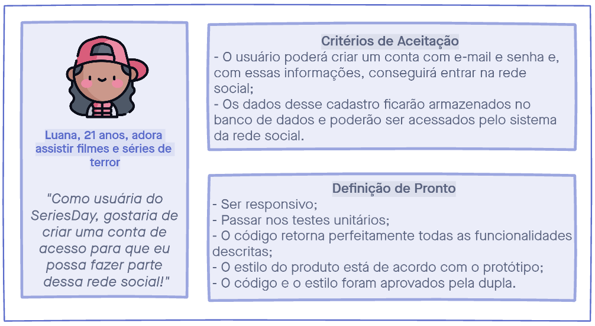

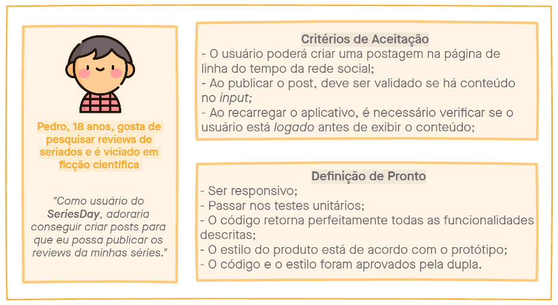
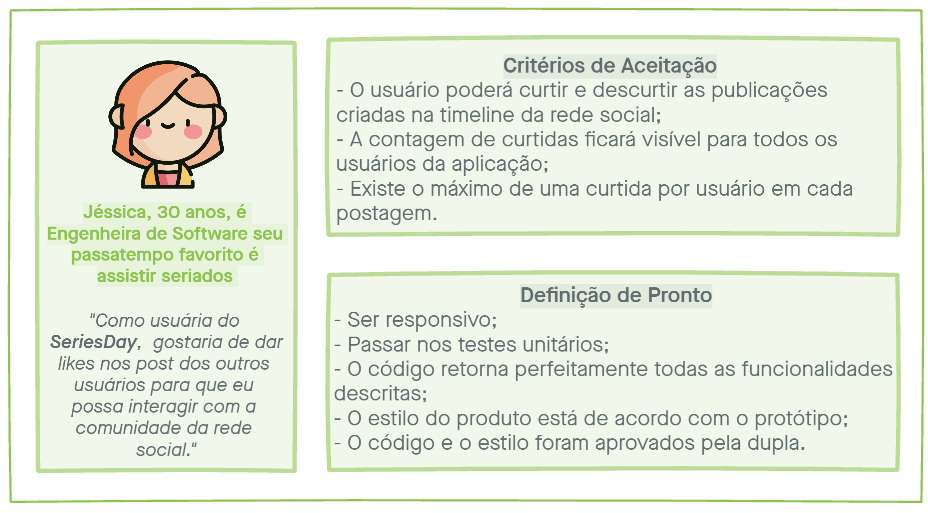
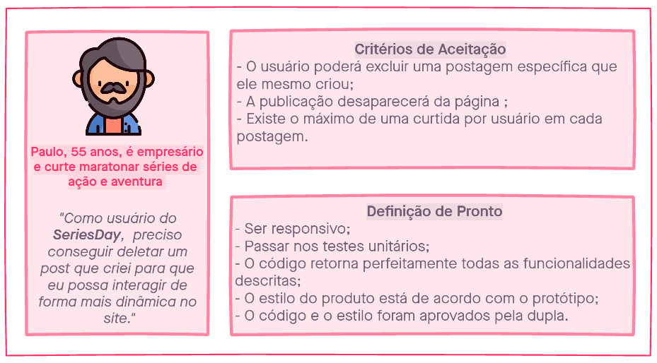

---
## :art: Protótipos 

* ####  Mobile
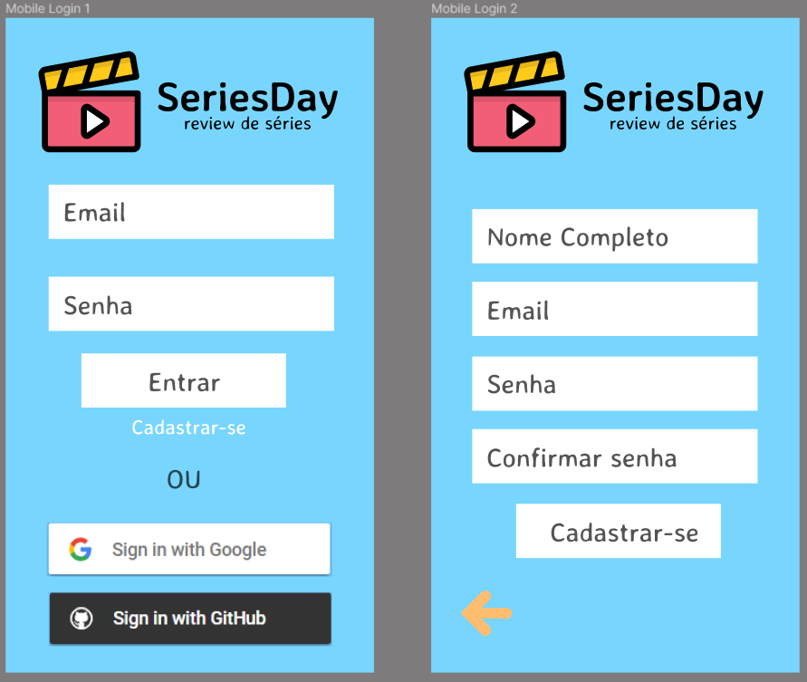

* #### Desktop
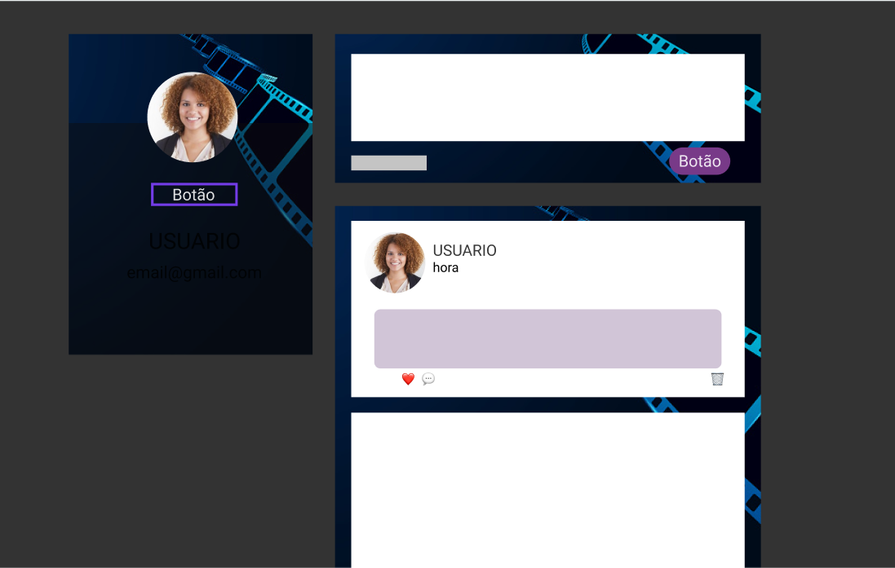

---
## :gear: Como usar?

- A tela inicial da aplicação traz **Página de Login** que apresenta ao usário as opções de fazer o login com email e senha já cadastrados, entrar na rede social por meio do login com Conta Google ou prosseguir para a Página de Cadastro;
- Na **Página de Cadastro**, o cliente pode cadastrar-se inserindo seus dados de Nome, E-mail e Senha;
- Ao realizar qualquer uma dessas três formas de acesso à rede social, o cliente será encaminhado para a **Página de Timeline**, onde ocorre toda a interação entre os usuários, como publicar, curtir, editar e deletar postagens. Nela, ainda existe uma área de perfil, onde são exibidos o nome, o email e a foto (alterável) do usuário;

---
## :busts_in_silhouette: Testes de Usabilidade
Durante o desenvolvimento do produto, foi realizado teste de usabilidade com diferentes indivíduos no intuito de analisar a experiência do usuário com a interface do site. Com base nos resultados desse teste, foram detectados os seguintes pontos de ajustes:

- Mais respostas visuais aos erros de login e cadastro no site
- Foto de perfil distorcida devido ao tamanho da imagem
- Cores que combinam melhor na Página de Timeline

Para a resolução dessas questões, foram implementadas mais respostas visuais, assim como modais para comunicar ao usuário sobre determinadas interações com o site. Além disso, no momento na alteração da foto de perfil, foi adicionada a informação sobre o tamanho ideal da foto para que a imagem encaixe-se perfeitamente. Já no design, foram feitas mudanças nas cores da Página de Timeline, de acordo com o sugerido no teste de usabilidade.

---
## :robot: Tecnologias utilizadas

| Ferramenta | Descrição |
| --- | --- |
| `HTML 5` | Linguagem de marcação |
| `CSS3` | Linguagem de estilização |
| `JavaScript` |  Linguagem de programação interpretada estruturada|
| `Jest` | Framework de teste em JavaScript|
| `Node.js` | Software de execução de códigos JavaScript|
| `Git e GitHub` | Sistemas de controle de versões distribuídos|
| `Firebase` | Plataforma desenvolvida pelo Google para a criação de aplicativos móveis e da web|

---

## :file_folder: Estrutura dos Principais Arquivos
```
.
├── 📁src
|   ├── 📁assets
|   ├── 📁pages
|   |   ├── 📁Login
|   |   |   ├── 📁_snapshots_
|   |   |   |   └── 📄index.spec.js.snap
|   |   |   ├── 📄index.js
|   |   |   ├── 📄index.spec.js
|   |   |   ├── 📄mock.js
|   |   |   └── 📄style.js
|   |   |
|   |   ├── 📁Register
|   |   |   ├── 📁_snapshots_
|   |   |   |   └── 📄index.spec.js.snap
|   |   |   ├── 📄index.js
|   |   |   ├── 📄index.spec.js
|   |   |   ├── 📄mock.js
|   |   |   └── 📄style.js
|   |   |
|   |   ├── 📁Timeline
|   |   |   ├── 📁_snapshots_
|   |   |   |   └── 📄index.spec.js.snap
|   |   |   ├── 📄index.js
|   |   |   ├── 📄index.spec.js
|   |   |   ├── 📄mock.js
|   |   |   └── 📄style.js
|   ├── 📁services
|   |   ├── 📄index.js
|   |   └── 📄index.spec.js
|   ├── 📄config.js
|   ├── 📄general.css 
|   ├── 📄index.html
|   └── 📄main.js
├── 📄README.md
└── 📄package.json

```

## ✔️ Resultados

* ####  Mobile (375px)
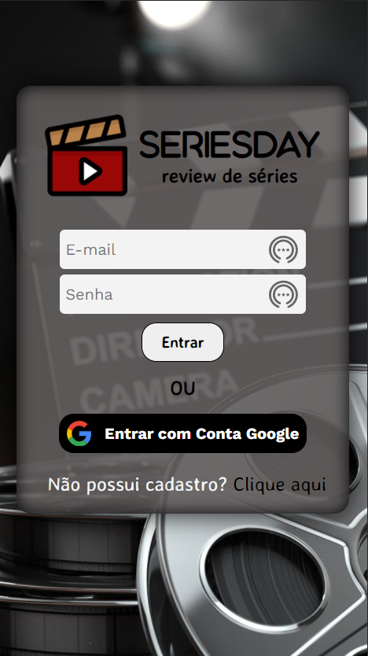
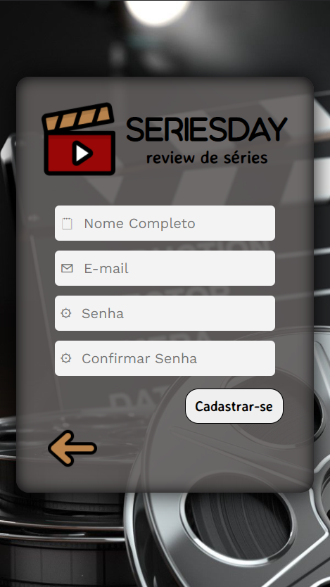
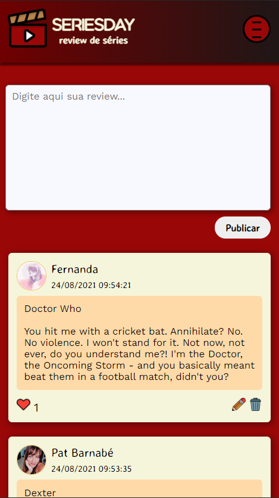
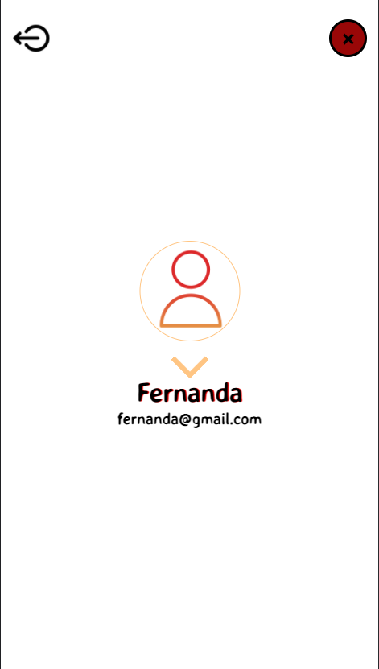

* #### Tablet (768px)
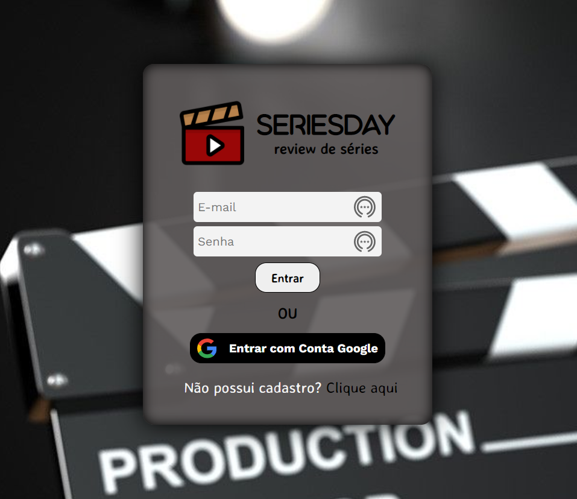
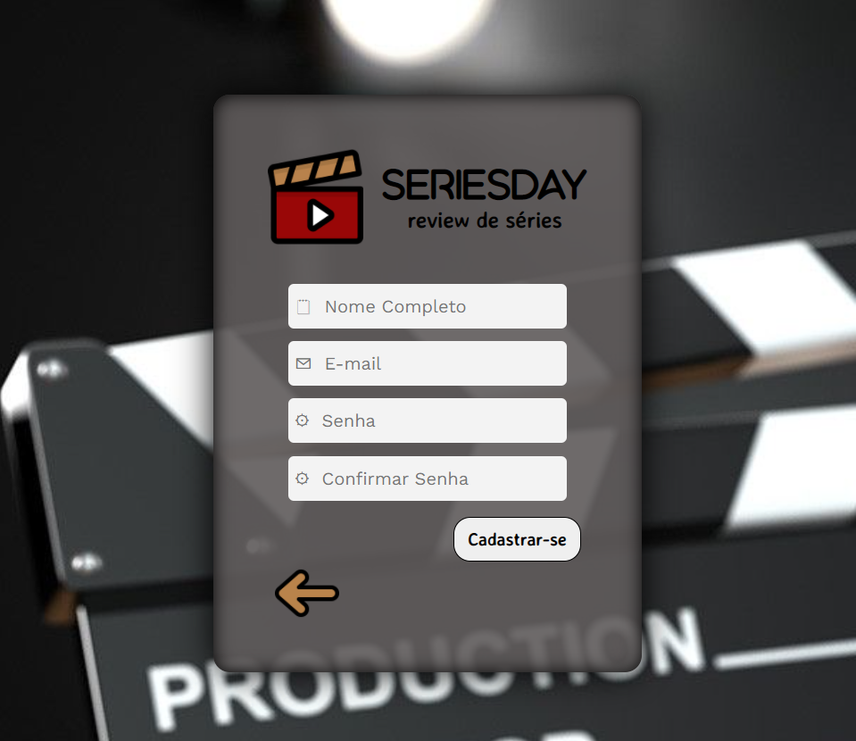
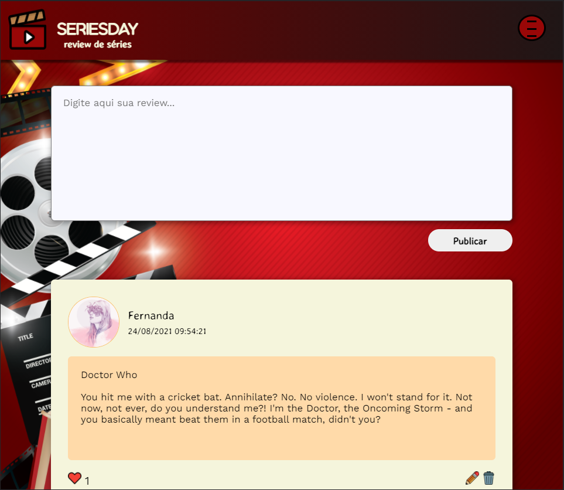


* #### Desktop (1440px)

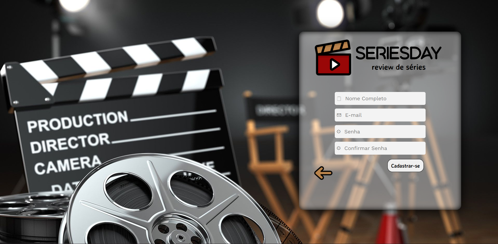
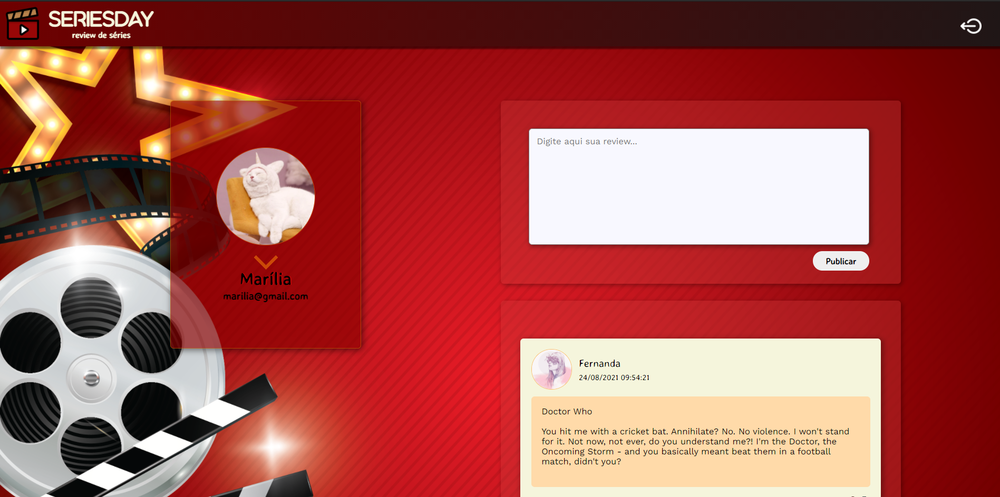

---
## :woman_technologist: Sobre as desenvolvedoras
### Patrícia Barnabé

- [LinkedIn](https://www.linkedin.com/in/patriciabarnabe)
- E-mail: patbarnabe5@gmail.com

### Larissa Vilela

- [LinkedIn](https://www.linkedin.com/in/larissa-vilela-sobral/)
- E-mail: larissavilelasobral@gmail.com
